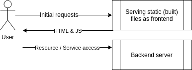
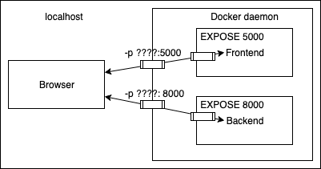

# MANDATORY EXERCISE 1.14: ENVIRONMENT

Start both frontend-example and backend-example with correct ports exposed and add ENV to Dockerfile with necessary information from both READMEs (front, back).

Ignore the backend configurations until frontend sends requests to `_backend_url_/ping` when you press the button.

You know that the configuration is ready when the button for 1.14 of frontend-example responds and turns green.

*Do not alter the code of either project*

Submit the edited Dockerfiles and commands used to run.

The frontend will first talk to your browser. Then the code will be executed from your browser and that will send a message to backend.

- TIP: When configuring web applications keep browser developer console ALWAYS open, F12 or cmd+shift+I when the browser window is open. Information about configuring cross origin requests is in README of the backend project.

- TIP: Developer console has multiple views, most important ones are Console and Network. Exploring the Network tab can give you a lot of information on where messages are being sent and what is received as response!

## Solution

Check the created Dockerfiles for the [frontend](example-frontend/Dockerfile) and the other for the [backend](example-backend/Dockerfile).

Build the images from both Dockerfiles:

`docker build -t example-frontend ./example-frontend && docker build -t example-backend ./example-backend`

And run the containers for both images, mapping the ports for each one:

`docker run --name example-frontend -p 5000:5000 example-frontend && docker run --name example-backend -p 8080:8080 example-backend`