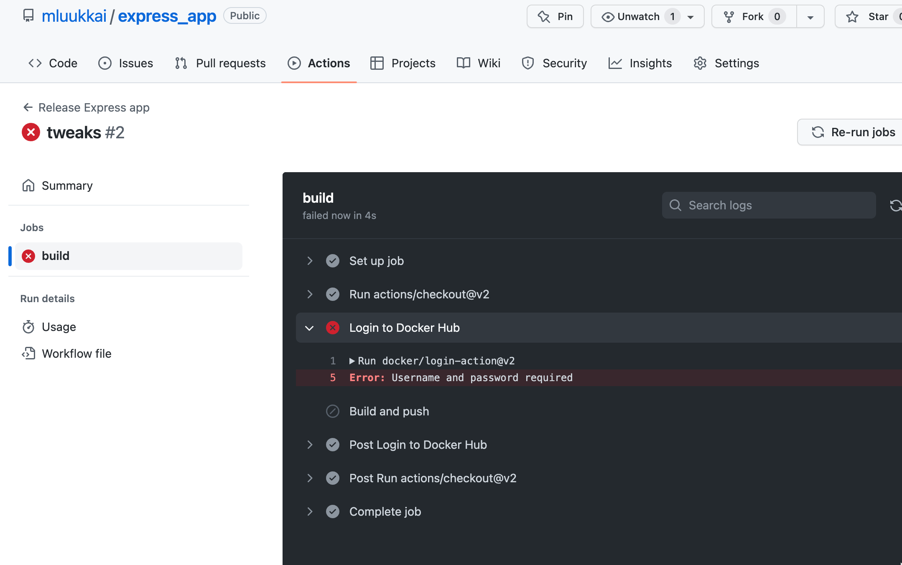

# Exercise 3.1: Your pipeline

Create now a similar deployment pipeline for a simple NodeJS/Express app found
[here](https://github.com/docker-hy/material-applications/tree/main/express-app).

Either clone the project or copy the files to your own repository. Set up similar deployment pipeline (or the "first half") using GitHub Actions that was just described. Ensure that a new image gets pushed to Docker Hub every time you push the code to GitHub (you may eg. change the message the app shows).

Note that there is importat change that you should make to the above workflow configuration, the branch should be named _main_:

```yaml
name: Release NodeJS app

on:
  push:
    branches:
      - main

jobs:
  build:
    runs-on: ubuntu-latest
    steps:
      # ...
```

The earlier example still uses the old GitHub naming convention and calls the main branch _master_.

Some of the actions that the above example uses are a bit outdated, so go through the documentation

- [actions/checkout](https://github.com/actions/checkout)
- [docker/login-action](https://github.com/docker/login-action)
- [docker/build-push-action](https://github.com/docker/)

and use the most recent versions in your workflow.

Keep an eye on the GitHub Actions page to see that your workflow is working:



Ensure also from Docker Hub that your image gets pushed there.

Next, run your image locally in detached mode, and ensure that you can access it with the browser.

Now set up and run the [Watchtower](https://github.com/containrrr/watchtower) just as described above.

You might do these two in a single step in a shared Docker Compose file.

Now your deployment pipeline is set up! Ensure that it works:
- make a change to your code
- commit and push the changes to GitHub
- wait for some time (the time it takes for GitHub Action to build and push the image plus the Watchtower poll interval)
- reload the browser to ensure that Watchtower has started the new version (that is, your changes are visible)

Submit a link to the repository with the config.

## Solution

Check the [created repository](https://github.com/mpatrickaires/devops-with-docker-university-of-helsinki-course-express-app).

### Now set up and run the Watchtower just as described above.

For that, first run the container with the image created for the exercise:

`docker run --name devops-with-docker-helsinki-express-app -d -p 8080:8080 matheuspatrick/devops-with-docker-helsinki-express-app`

Now, run Watchtower (I've set it to check only the container of this exercise by passing the container name as an argument and to check for changes every 30 seconds, instead of 24 hours which is the default, by also passing an argument with `--interval`):

`docker run --name watchtower -v /var/run/docker.sock:/var/run/docker.sock containrrr/watchtower devops-with-docker-helsinki-express-app --interval 30`
